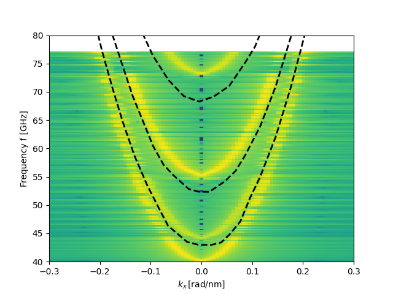

.. currentmodule:: magnumnp

:tocdepth: 1

###########
Eigensolver
###########

The linearized LLG can be used to describe small deviations from an equilibrium state like e.g. small-amplitude spin waves. A transformation into the frequency-domain leads to an eigenvalue problem, which can be solved by an iterative Arnoldi Method. The results is a discrete set of eigenmodes and eigenfrequencies, which can in turn be used to derive e.g. the dispersion relation of magnonic systems.

The following example shows how to use the EigenSolver to calculate the Spin Wave Dispersion in a Magnonic Waveguide [VENKAT]. Starting as usual with a Mesh and a State object, defining all material parameters and an initial state. The eigensolver assumes that the provided magnetization is an energy minimum. Therefor one needs to relax the intial magnetization or use direct energy minimization.

.. code-block:: python

    n = (400, 20, 1)
    dx = (2.5e-9, 2.5e-9, 1e-9)
    
    mesh = Mesh(n, dx)
    state = State(mesh)
    state.material = {
            "A": 13e-12,
            "Ms": 800e3,
            }
    
    state.m = state.Constant([1.,0.,0.])
    
    demag    = DemagField()
    exchange = ExchangeField()
    external = ExternalField([804e3,0.0,0.0])

    # calculate groundstate
    try:
        mesh0, fields0 = read_vti("data/m0_dispersion.vti")
        state.m[...] = fields0["m0"]
    except:
        with Timer("Calculate Groundstate"):
            minimizer = MinimizerBB([demag, exchange, external])
            minimizer.minimize(state)
            write_vti({"m0":state.m}, "data/m0_dispersion.vti", state)

After the groundstate has been calculated the actual eigenvalue problem can be solved.
The user has to specify the number of discrete eigenvalues that should be calculated.

.. code-block:: python

    with Timer("Calculate Eigenvectors"):
        try:
            res = EigenResult.load(state, "data/eigen.pt")
        except:
            eigen = EigenSolver(state, [demag, exchange], [external])
            res = eigen.solve(k=200, tol=1e-6)
            res.store("data/eigen.pt")

    with Timer("Store evecs"):
        print("evals[GHz]:", res.freq.cpu().numpy()*1e-9)
        res.save_evecs3D("data/evecs.pvd")

The EigenSolver returns an ``EigenResult`` object which allows further post processing of the data. It provides simple IO and e.g. also calculating the dispersion relation. Since the EigenSolver already works in the frequency-domain only the spatial eigenvectors need to be Fourier transformed to get the desired dispertion relation:

.. code-block:: python

    with Timer("Calculate Dispersion"):
        points = lambda vvv: vvv[:,10,0,2,:]
        omega = res.omega.cpu().numpy()
        kk, ww, mm = res.dispersion(points, dx[0])
    
        fig, ax = plt.subplots()
        cbmax = np.log10(mm*2.).max()
        cbmin = np.log10(mm*2.).min()
        ax.pcolormesh(kk*1e-9, ww*1e-9/2./np.pi, np.log10(np.abs(mm)**2.), cmap = "viridis") #, vmax = cbmax, vmin = cbmin, shading = "auto")
        ax.set_xlim([-0.3, 0.3])
        ax.set_ylim([40, 80])
        ax.set_xlabel('$k_{x}\,\mathrm{[rad/nm]}$')
        ax.set_ylabel('Frequency f [GHz]')
        fig.savefig("data/dispersion.png")

The line along which the FFT should be performed and also the component of the magnetization that should be used needs to be provided by the user. This is done in form of a ``lambda`` function, which provides to most possible flexibility (e.g. even points along curved paths would be feasible). 

Complete Code
*************

The complete code can be viewed here: :download:`run.py <../demos/eigensolver/run_dispersion.py>`.

.. autoclass:: EigenSolver
   :members:
   :special-members:

References
==========

.. [dAquino2009] M. d'Aquino, C. Serpico, G. Miano, and C. Forestiere, "Spectral micromagnetic analysis of switching processes," Journal of Applied Physics 105, 07D541 (2009).
