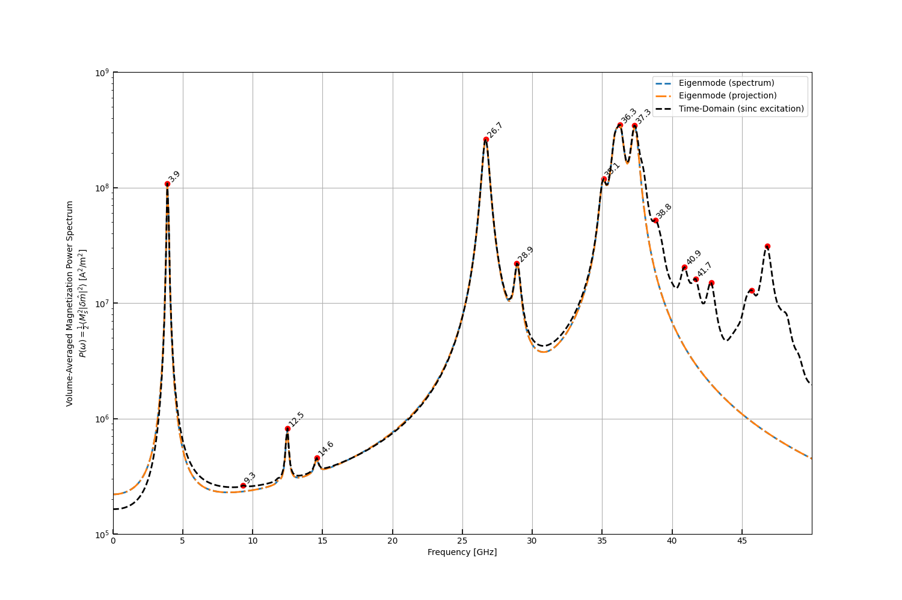

.. currentmodule:: magnumnp

########################################################
Antiferromagnetically Coupled Bilayer (run_bilayer.py)
########################################################

This example considers an antiferromagnetically coupled bilayer with dimensions 120 nm x 120 nm x 10 nm, discretized on a 24 x 24 x 2 grid (cell size 5 nm x 5 nm x 5 nm).
Each layer occupies one cell along the z-direction.
A static bias field and a Neel skyrmion texture are used to initialize the magnetization, with opposite core polarities in the two layers.

Setup
=====

The material parameters are :math:`M_s = 800\,\text{kA/m}`, :math:`A = 13\,\text{pJ/m}`, interfacial DMI :math:`D_i = -3\,\text{mJ/m}^2`, uniaxial anisotropy :math:`K_u = 0.5\,\text{MJ/m}^3` along z, RKKY interlayer coupling with :math:`J_{\mathrm{RKKY}} = -0.3\,\text{mJ/m}^2`, and :math:`\alpha = 0.008`.

.. code-block:: python

    n = (24, 24, 2)
    l = (120e-9, 120e-9, 10e-9)
    dx = (l[0]/n[0], l[1]/n[1], l[2]/n[2])

    state.material = {
        "alpha": 0.008,
        "Ms": 800e3,
        "A": 13e-12,
        "Di": -3e-3,
        "Ku": 0.5e6,
        "Ku_axis": [0,0,1]
        }

The two layers are treated with separate exchange fields, and the interlayer coupling is handled by the :class:`RKKYField`:

.. code-block:: python

    exchange_b = ExchangeField(domain1)
    exchange_t = ExchangeField(domain2)
    dmi        = InterfaceDMIField()
    aniso      = UniaxialAnisotropyField()
    rkky       = RKKYField(-3e-4, "z", 0, 1)

Groundstate
===========

The equilibrium state is obtained by energy minimization:

.. code-block:: python

    minimizer = MinimizerBB([exchange_b, exchange_t, dmi, aniso, rkky, bias])
    minimizer.minimize(state, maxiter=5000, dm_tol=1e-4)

Eigenmode Calculation
=====================

The first 20 eigenmodes are computed from the generalized eigenvalue problem:

.. code-block:: python

    eigen = EigenSolver(state, [exchange_b, exchange_t, rkky, aniso, dmi], [bias])
    res = eigen.solve(k=20)

Power Spectrum and Projection
=============================

Both the eigenmode-based power spectrum :math:`\tilde{p}(\omega)` and the modal projection are computed and compared with a time-domain simulation using a sinc-pulse excitation (:math:`f_{\mathrm{max}} = 100\,\text{GHz}`, total simulation time 10 ns, time step :math:`\Delta t = 2\,\text{ps}`):

.. code-block:: python

    spectrum   = res.spectrum(2*np.pi*freq, excite.h(state))
    projection = res.projection(2*np.pi*freq, delta_m)

Complete Code
=============

The complete code can be viewed here: :download:`run_bilayer.py <../demos/eigensolver/run_bilayer.py>`.
