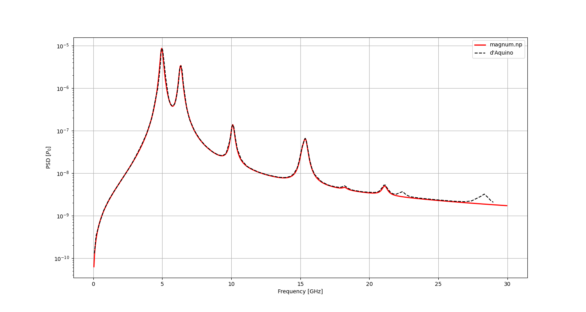

.. currentmodule:: magnumnp

#######################################
Elliptical Nanodisc (run_carlotti.py)
#######################################

This example applies the eigenmode method to an elliptical Permalloy nanodisc with dimensions 200 nm x 100 nm x 5 nm, discretized on a 200 x 100 x 1 finite-difference grid with a cell size of 1 nm x 1 nm x 5 nm.
The elliptical shape is defined by masking cells outside the ellipse boundary.
The material parameters are :math:`M_s = 800\,\text{kA/m}`, :math:`A = 13\,\text{pJ/m}`, and :math:`\alpha = 0.01`.
The effective field includes exchange and demagnetization contributions.

Setup
=====

The mesh and state are initialized, and the elliptical domain is defined by setting the material parameters to zero outside the ellipse:

.. code-block:: python

    n = (200, 100, 1)
    dx = (1e-9, 1e-9, 5e-9)

    mesh = Mesh(n, dx, origin = (-n[0]*dx[0]/2., -n[1]*dx[1]/2., 0.0))
    state = State(mesh, scale = 1e9)

    Ms = 800e3
    state.material = {
            "A": 13e-12,
            "Ms": Ms,
            "alpha": 0.01
            }

    x, y, z = mesh.SpatialCoordinate()
    a = 200e-9 / 2.
    b = 100e-9 / 2.
    magnetic = (x/a)**2. + (y/b)**2. <= 1.

    state.m = state.Constant([1.,0.,0.])
    state.material["Ms"][~magnetic] = 0.
    state.material["A"][~magnetic] = 0.

Groundstate
===========

The equilibrium magnetization is obtained by energy minimization using the Barzilai--Borwein method:

.. code-block:: python

    demag    = DemagField()
    exchange = ExchangeField()

    minimizer = MinimizerBB([demag, exchange])
    minimizer.minimize(state)

Eigenmode Calculation
=====================

The first 20 eigenmodes are computed by solving the generalized eigenvalue problem with the Lanczos algorithm.
The ``domain`` parameter restricts the eigensolver to the magnetic region defined by the elliptical mask:

.. code-block:: python

    eigen = EigenSolver(state, [demag, exchange], [], domain = magnetic)
    res = eigen.solve(k=20, tol=1e-6)

Absorbed Power Spectrum
=======================

The absorbed magnetic power :math:`\hat{P}_{\mathrm{abs}}(\omega)` is evaluated semi-analytically from the modal expansion using a uniform in-plane excitation field :math:`\tilde{\boldsymbol{h}}^{\mathrm{a}} = (0,\; 0.5\,\text{mT}/\mu_0,\; 0)`:

.. code-block:: python

    freq = np.arange(0.05e9, 30e9, 0.05e9)
    h_excite = state.Constant([0., 0.5e-3/constants.mu_0, 0.])
    absorption = res.absorption(2*np.pi*freq, h_excite)

The result is compared with reference data from d'Aquino et al. [dAquino2023b]_:

Complete Code
=============

The complete code can be viewed here: :download:`run_carlotti.py <../demos/eigensolver/run_carlotti.py>`.

References
==========

.. [dAquino2023b] M. d'Aquino and R. Hertel, "Micromagnetic frequency-domain simulation methods for magnonic systems," Journal of Applied Physics 133, 033902 (2023).
