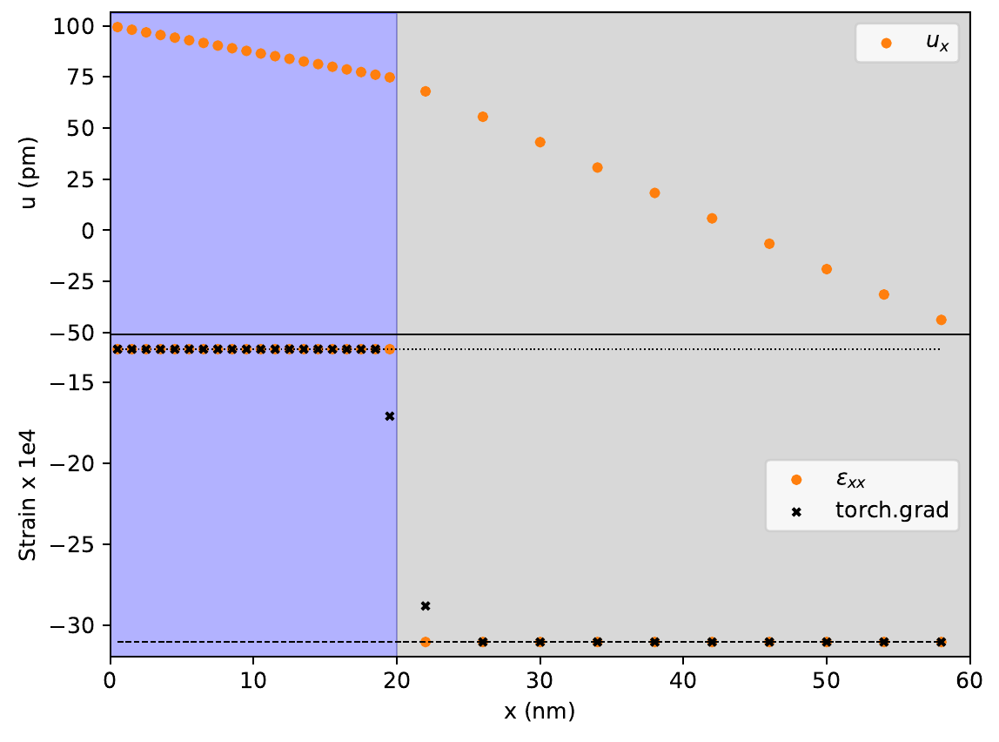
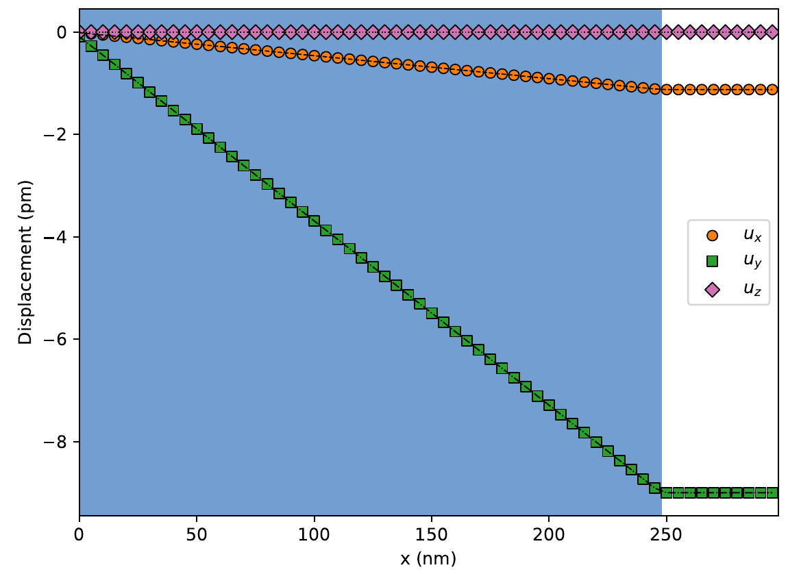
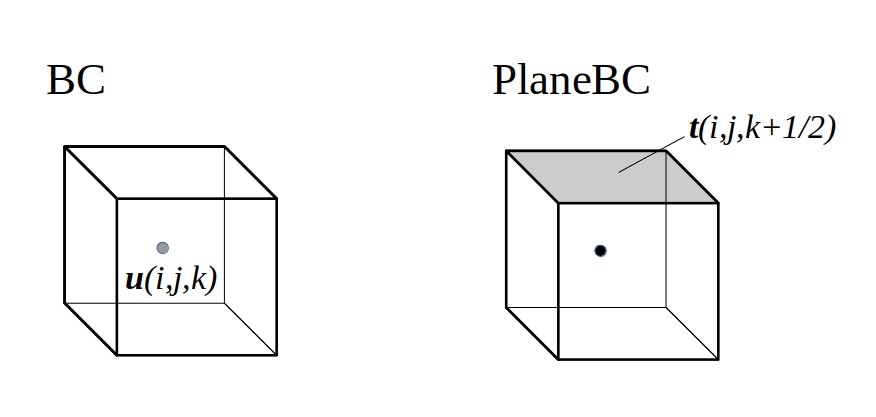

.. currentmodule:: magnumnp

:tocdepth: 1

#################
Linear Elasticity
#################

In the theory of linear elasticity, the strain :math:`\varepsilon` associated with the displacement :math:`\bm{u}` is given by the symmetric part of the gradient of :math:`\bm{u}`:

.. math::
  \varepsilon_{i,j} = \frac{1}{2}\left(\frac{\partial u_i}{\partial x_j}+\frac{\partial u_j}{\partial x_i} \right)

The stress :math:`\sigma=C:\varepsilon` is related to the strain by the :math:`3\times 3\times 3\times 3` stiffness tensor :math:`C`. In Voigt notation, the stress and strain written as

.. math::
  \bm{\varepsilon} = \left(\begin{matrix}
    \varepsilon_{xx} \\
    \varepsilon_{yy} \\
    \varepsilon_{zz} \\
    2\varepsilon_{yz} \\
    2\varepsilon_{xz} \\
    2\varepsilon_{xy}
  \end{matrix}\right)
  \;\;\;\;\text{ and }\;\;\;\;
  \bm{\sigma} = \left(\begin{matrix}
    \sigma_{xx} \\
    \sigma_{yy} \\
    \sigma_{zz} \\
    \sigma_{yz} \\
    \sigma_{xz} \\
    \sigma_{xy}
  \end{matrix}\right),

respectively. In this notation, the stress is computed from the product of the :math:`6\times 6` stiffness matrix with the vectorial strain.

.. math::
  \bm{\sigma} = C\cdot\bm{\varepsilon}

Since magnum.np is a finite difference code, we will limit our considerations to materials with stiffness matrices of the form

.. math::
  C = \left(\begin{array}{cccccc}
  C_{11} & C_{12} & C_{13} & 0 & 0 & 0 \\
  C_{12} & C_{22} & C_{23} & 0 & 0 & 0 \\
  C_{13} & C_{23} & C_{33} & 0 & 0 & 0 \\
  0 & 0  & 0 & C_{44} & 0 & 0 \\
  0 & 0  & 0 & 0 & C_{55} & 0 \\
  0 & 0  & 0 & 0 & 0 & C_{66}
  \end{array}\right)

here. This form of the stiffness matrix is sufficient for materials with an orthonormal basis that is aligned with the main axes.

*************************************
Jump Conditions in Finite Differences
*************************************

Let's consider a 1D example, where the only deformation happens in the x-direction: two materials are stacked along the x-axis and are compressed by Dirichlet boundary conditions:

.. math::
  u_x(x_0) = u_L \\
  u_x(x_{N-1}) = u_R

Note that :math:`x_0\neq0` if the mesh origin is not set to enforce this. Conceptually, the length of the stack in this example is not :math:`\sum_i\Delta x_i` but :math:`L_x=\sum_i\Delta x_i - (\Delta x_0 + \Delta x_{N-1})/2`.
In its relaxed state, the force density :math:`f=\partial_x\sigma_{xx}` vanishes and thus, the stress :math:`\sigma_{xx}=C_{11}\partial_x u_x` needs to be constant. Since the stiffness of the two materials differs, the strain :math:`\epsilon_{xx}=\partial_x u_x` has a jump at the material interface at :math:`x’`, such that

.. math::
  C_{11}^I \lim_{x \to x'} \partial_x u_x = C_{11}^{II} \lim_{x' \leftarrow x} \partial_x u_x.

Both the first and second derivative implementations of magnum.np ensure that this condition is fulfilled, both on regular and non-regular grids.

***************************
Coupled System of Equations
***************************

In ferromagnetic materials, the magnetic and elastic degrees of freedom are coupled by the (inverse) magnetostrictive effect. In cubic materials (:math:`C_{11}=C_{22}=C_{33}`, :math:`C_{12}=C_{23}=C_{13}` and :math:`C_{44}=C_{55}=C_{66}`), the magnetization state results in a magnetostrictive strain

.. math::
  \varepsilon^m_{ij} = \left\lbrace\begin{array}{ll}
  \frac{3}{2}\lambda_{100}\left(m^2_i - \frac{1}{3} \right) & \text{if }i=j \\
  \frac{3}{2}\lambda_{111}m_i m_j  & \text{if }i\neq j \\
  \end{array}\right.

where :math:`\lambda_{100}` and :math:`\lambda_{111}` are the magnetostrictive parameters. The elastic part of the strain is

.. math::
  \varepsilon^\text{el} = \varepsilon-\varepsilon^m

and from it, the magnetoelastic potential energy can be computed as

.. math::
  U^\text{el} = \frac{1}{2}\int_{\Omega_m\cup\Omega_u} \left(\varepsilon-\varepsilon^m\right):C:\left(\varepsilon-\varepsilon^m\right)\text{d}\bm{x}

From this energy contribution, a contribution to the effective field :math:`\bm{H}^\text{eff}` for the LLG can be obtained from the functional variation with respect to :math:`\bm{m}`. The coupled dynamics of the magnetization :math:`\bm{m}`, the displacement :math:`\bm{u}` and the momentum density :math:`\bm{p}=\rho\dot{\bm{u}}` can be obtained from the set of equations

.. math::
   \frac{\partial}{\partial t}
   \left(
   \begin{matrix}
     \bm{m} \\
     \bm{u} \\
     \bm{p}
   \end{matrix}
   \right)
   =
   \left(
   \begin{matrix}
     -\frac{\gamma}{1+\alpha^2}
     \left[
       \bm{m}\times\bm{H}^\text{eff} + \alpha\bm{m}\times\left(\bm{m}\times\bm{H}^\text{eff}\right)
     \right]
     \\
     \bm{p}/\rho
     \\
     \nabla\cdot\sigma^\text{el} - \eta\bm{p}/\rho
   \end{matrix}
   \right)

in combination with the following boundary conditions: The displacement can be fixed by Dirichlet boundary conditions :math:`\bm{u}=\bm{u}_0` on :math:`\Omega_u`, or the traction might be set in form of Neumann boundary conditions :math:`(\sigma-\sigma^m)\cdot\hat{n}=\bm{t}` on :math:`\Omega_t`. Additionally, in the absence of other boundary field contributions, the exchange field requires the magnetization to obey :math:`A\bm{\nabla}\bm{m}\cdot\hat{n}=0` on :math:`\partial\Omega_m`.

The solver ``LLGWithLESolver`` allows for the time-integration of these equations, and the boundary conditions of the mechanical part of the system can be set using ``BC`` for Dirichlet boundary conditions and ``PlaneBC`` for Neumann boundary conditions.

*****************************************
Jump Conditions Involving Magnetic Stress
*****************************************

From the bulk equations, we can infer that a gradient in the magnetization direction results in a contribution to the force density. But also the Neumann boundary conditions :math:`(\sigma-\sigma^m)\cdot\hat{n}=\bm{t}` on :math:`\Omega_t` couple the mechanical stress to the magnetization, and through them, even a homogeneous magnetization can result in a deformation of the material. Naturally, we expect this behavior not only on open surfaces, but also at interfaces between magnetic and non-magnetic materials. Let's consider another 1D example, where a non-magnetic material is stacked on a ferromagnetic material. The bottom side of the ferromagnetic layer is fixed by Dirichlet boundary conditions, and the top surface of the non-magnetic layer is a free surface. From the magnetoelastic coupling term, here written in Voigt notation, we expect that the stack would relax into a form in which :math:`\bm{\sigma} = \bm{\sigma}^m`.

.. math::
  U^\text{el} = \frac{1}{2}\int_{\Omega_m\cup\Omega_u} \left(\bm{\varepsilon}-\bm{\varepsilon}^m\right)\cdot\left(\bm{\sigma}-\bm{\sigma}^m\right)\text{d}\bm{x}

In our 1D stack, this allows us to infer the slopes of the relaxed displacement:

.. math::
  \partial_x u_x = \varepsilon_{xx}^m + \frac{C_{12}}{C_{11}}\left(\varepsilon_{zz}^m+\varepsilon_{yy}^m\right) \\
  \partial_x u_y = \frac{3}{2}\lambda_{111}m_xm_y \\
  \partial_x u_z = \frac{3}{2}\lambda_{111}m_xm_z

Since this interfacial coupling between the magnetization and the mechanical stress is considered in the implementation of the Neumann boundary conditions as well as the jump conditions in the first and second spatial derivatives, magnum.np can correctly reproduce the expected behavior.
The latter ensures that the traction vector

.. math::
  \bm{t}=\left(\sigma-\sigma^m\right)\cdot\hat{n}

is continuous at interfaces with normal direction :math:`\hat{n}`.

**********************************************
Coupling between Spin-Waves and Acoustic Waves
**********************************************

Due to this coupling, acoustic waves can excite spin waves in ferromagnetic materials. The following demo shows how the self-consistent dynamics of the magnetization and mechanical displacement can be obtained for an acoustic bulk mode.

------------------
State and Material
------------------

To investigate the coupling with a bulk mode, a quasi-1D mesh with periodic boundary conditions is sufficient.

.. code-block:: python

    mesh = Mesh(n, dx, pbc=(0,1,1))
    state = State(mesh)

The coupled magnetoelastic solver requires additional material parameters. These are the mass density ``"rho"`` given in :math:`\text{kg/m}^3`, the stiffness matrix ``"C"`` given in :math:`\text{N/m}^2` and written in Voigt notation, the dimensionless coupling parameters ``"lambda_100"`` and ``"lambda_111"`` as well as a phenomenological damping parameter ``"eta"``, which is set to zero in this example and is mainly used to relax structures.

The dynamics of the mechanical degrees of freedom further depends on the magnetization, and is also explicitly dependent on the exchange constant ``"A"`` at boundary and material interface cells.

.. code-block:: python
    state.material = {
            "alpha": state.Constant(alpha),
            "Ms": state.Constant(Ms),
            "A": state.Constant(Aex),
            "rho": state.Constant(rho),
            "C": state.Constant(C_cubic(C11, C12, C44)),
            "lambda_100": state.Constant(lambda_100),
            "lambda_111": state.Constant(lambda_111),
            "eta": state.Constant(eta)
        }

The mechanical degrees of freedoms need to be initialized together with the magnetization as members of ``state``. The displacement is ``state.ud``, the momentum density is ``state.pd``. For this example, we do not relax the structure but instead compute the initial displacement due to the magnetic strain.

.. code-block:: python

    # initial conditions
    state.m = state.Constant((0.,0.,1.))
    state.pd = state.Constant((0.,0.,0.))

    # ... initial displacement due to magnetic strain
    kx_x = -0.5*lambda_100
    kx_y = -0.5*lambda_100
    kx_z = lambda_100
    kx = kx_x + (C12/C11)*(kx_y + kx_z)

    x = mesh.SpatialCoordinate()[0]
    state.ud[...,0] = -((Lx-0.5*dx[0])-x)*kx

-------------------------------------
Field Terms and Solver Initialization
-------------------------------------

The coupled solver automatically considers the magnetic state when updating the displacement and momentum density, but the magnetoelastic field term needs to be added manually to the list of considered field terms by the user.

The parameter ``C_sym`` in the constructor of the coupled solver allows the user to specify which terms of the stiffness matrix are non-zero. Specifying this can result in better timings. We also set ``iteration_depth=0``. This indicates that gradient components of the displacement do not need to be computed iteratively, as it would be necessary for a 2D or 3D problem. The reason for this is that in our 1D example, only spatial derivatives of :math:`x` are non-zero, and no transversal gradient components can enter the jump conditions of the spatial derivatives.

.. code-block:: python

    bias = ExternalField(state.Constant((0, 0, h0))
    exchange = ExchangeField()
    magEl = MagnetoElasticField()
    h_terms = [bias, exchange, magEl]

    llg = LLGWithLESolver(h_terms, C_sym="cubic", iteration_depth=0, boundary_nodes=3, dt=dt)

-------------------------------------------
Boundary Conditions for the Elastic Problem
-------------------------------------------

When we initialized the coupled solver, we specified the number of boundary nodes used for boundary value computations by setting ``boundary_nodes = 3``. The number of boundary nodes used (counting inwards from the boundary) can be set between 1 and 3. Using three nodes will result in the highest accuracy, but it also requires that the first three cells from all boundaries belong to the same material.

| When ``boundary_nodes = 3`` is set, the boundary node values of the strain i.e. the spatial derivatives of the displacement components will be calculated using a second order scheme. For open surfaces, the boundary node values of the force density will be updated using these boundary node values, the strain on the neighbouring bulk node and the traction set as Neumann boundary conditions on the surface.
| When ``boundary_nodes = 2`` is set, the strain is calculated from forward and backward differences formulas at the boundary nodes. At open surfaces, the force density is calculated from the traction given by the Neumann boundary condition and the strain on the first bulk node. Therefore, the boundary values of the strain, that are computed from forward or backward differences, are skipped when computing the force density on the boundary nodes.
| The default is ``boundary_nodes = 1``, where forward and backward differences are used for the boundary values of the displacement gradients and the force density. This method is inaccurate, but applicable even if the first two layers of cells counting from the surface belong to different materials.

This setting informs the solver how to handle the boundary conditions, but the boundary conditions themselves need to be added in form of dictionary as member ``state.bcs``. The keys specify the type of the boundary condition. The key ``"ud"`` is associated with Dirichlet boundary conditions, and the corresponding value has to be a list of ``BC``. The key ``"t"`` is associated to Neumann boundary conditions and the corresponding value needs to be a list of ``PlaneBC``. The main difference between the two is *where* the boundary conditions are defined. ``BC`` is used to set value of ``state.ud`` on the cell center while ``PlaneBC`` is used to set the traction at a cell interface.

.. csv-table:: Boundary Conditions
   :header: "Type", "key", "Type", defined at

   "Dirichlet BCs", ``"ud"``, ":code:`list[BC]`", "cell center"
   "Neumann BCs", ``"t"``, ":code:`list[PlaneBC]`", "cell interface"

.. code-block:: python

    u_mask = torch.zeros(n, dtype=torch.bool)
    u_mask[-1] = 1
    u_cond = lambda state : torch.zeros((n[1], n[2], 3))

    dirichlet_bcs = []
    dirichlet_bcs.append(BC(u_mask, u_cond))

    # ... left shear traction
    def t0_cond(state):
        nx, ny, nz = state.mesh.n

        t0 = u0 * C44 * k

        t_in = torch.zeros((ny, nz, 3))
        t_in[:,:,2] = t0 * np.sin(float(state.t) * omega)

        return t_in

    neumann_bcs = []
    neumann_bcs.append(PlaneBC(Plane(0, 0, -1), t0_cond))

    state.bcs = dict()
    state.bcs["ud"] = dirichlet_bcs
    state.bcs["t"] = neumann_bcs

.. note::
    If no Neumann boundary condition and no Dirichlet boundary condition is set at a boundary cell, homogeneous Neumann boundary conditions are set automatically.

.. note::
    It is also possible to introduce an airbox, or individual cells of air (cells or layers in which the stiffness matrix is set to zero) to enforce homogeneous Neumann boundary conditions. This method generally yields the most stable results, since the boundary conditions are enforced already from the jump conditions when calculating the spatial derivatives.

.. autoclass:: BC

.. autoclass:: PlaneBC

.. autoclass:: Plane

---------------------
Time Step and Logging
---------------------

Time steps are performed analogous to time stepping with ``LLGSolver``.

.. code-block:: python

    llg.step(state, dt)

Besides the relative tolerance ``rtol``, the absolute tolerance can be specified for the magnetization, displacement and momentum density individually by the arguments ``atol_m``, ``atol_ud``, and ``atol_pd``, respectively.

For logging purposes, the coupled solver allows to compute multiple energy terms from builtin methods.

.. csv-table:: Energy terms
   :header: "Method", "Energy Terms"

   ":code:`LLGWithLESolver.E(state)`", "Sum of the energy of the magnetic field terms"
   ":code:`LLGWithLESolver.U_el(state)`", "Elastic potential energy"
   ":code:`LLGWithLESolver.U(state)`", "Mechanical potential energy"
   ":code:`LLGWithLESolver.T_el(state)`", "Kinetic Energy"

-------------
Complete Code
-------------

The complete code can be viewed here: :download:`run.py <../demos/linear_elasticity/bulk_shear_mode/run.py>`.

**************
Coupled Solver
**************

.. autoclass:: LLGWithLESolver
