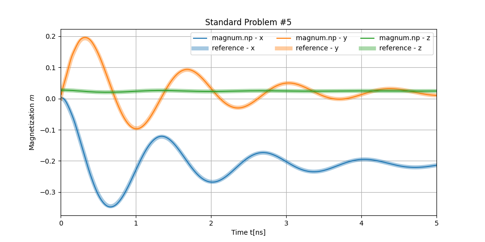

:tocdepth: 1

###############
Getting Started
###############

The following demo code shows the solution of the muMAG Standard Problem #5 and can be found in the demos directory. This problem examines the effects of a constant current in the plain of a magnetic material on the trajectory of a magnetic vortex. Google Colab allows to run magnum.np demos without local installation on CPUs as well as on GPUs.

Standard Problem #5
*******************
As magnum.np is a Python library this simulation script is a Python script meaning magnum.np first needs to be imported with

.. code-block:: python

  from magnumnp import *

Timer.enable() is used to measure the duration of the simulation.

.. code-block:: python

  Timer.enable()

Next the state is initialized. To do so a mesh is created where *n* defines a rectangular cuboid that represents the magnetic material and *dx* denotes the discretization. For this problem the material is defined as constant and homogeneous.

.. code-block:: python

  # initialize state
  n  = (40, 40, 1)
  dx = (2.5e-9, 2.5e-9, 10e-9)
  mesh = Mesh(n, dx)

  state = State(mesh)
  state.material = {
      "Ms": 8e5,
      "A": 1.3e-11,
      "alpha": 0.1,
      "xi": 0.05,
      "b": 72.17e-12
      }

The initial magnetization *m* is defined using torch.Tensor. The elements of the tensor can be accessed using Python's slicing. *j* is the in-plain current in x-direction which will be applied to the initial magnetization vortex pattern.

.. code-block:: python

  # initialize magnetization that relaxes into s-state
  state.m = state.Constant([0,0,0])
  state.m[:20,:,:,1] = -1.
  state.m[20:,:,:,1] = 1.
  state.m[20,20,:,1] = 0.
  state.m[20,20,:,2] = 1.

  state.j = state.Tensor([1e12, 0, 0])

In the following step the field terms are initialized. Here the demagnetization field, the exchange field and spin torque are defined.

.. code-block:: python

  # initialize field terms
  demag    = DemagField()
  exchange = ExchangeField()
  torque   = SpinTorqueZhangLi()

The initial state for any further simulations is the magnetic vortex pattern of an s-state. This is a state in an equilibrium configuration found by applying the Landau-Lifshitz-Gilbert equation to the previously defined state. To produce this state an LLG solver is applied with the demagnetization field and the exchange field as the only effective contributors to the relaxation of the system.

.. code-block:: python

  # initialize sstate
  llg = LLGSolver([demag, exchange])
  llg.relax(state)
  write_vti(state.m, "data/m0.vti", state)

Once the initial magnetic vortex pattern is found the LLG solver is reapplied, this time including the effects of the spin torque. The components of the magnetization at every time step are spacially averaged and logged using the :class:`.ScalarLogger` class. With the while loop the movement of the vortex is simulated for 5ns with a time step of 0.01ns. For each time step the results are written into *data/m.dat*\ .

.. code-block:: python

  # perform integration with spin torque
  llg = LLGSolver([demag, exchange, torque])
  logger = ScalarLogger("data/m.dat", ['t', 'm'])
  while state.t < 5e-9:
      llg.step(state, 1e-11)
      logger << state

  Timer.print_report()

Finally the results are plotted alongside reference data to allow for comparison between the published results and the results achieved through magnum.np, in order to catch mistakes in the code when new features are added.

.. code-block:: python

  # plot the results
  data = np.loadtxt("data/log.dat")
  ref = np.loadtxt("data/m_ref.dat")

  fig, ax = plt.subplots(figsize=(10,5))
  cycle = plt.rcParams['axes.prop_cycle'].by_key()['color']

  ax.plot(data[:,0]*1e9, data[:,1], '-', color = cycle[0], label = "magnum.np - x")
  ax.plot(ref[:,0]*1e9, ref[:,1], '-', color = cycle[0], linewidth = 6, alpha = 0.4, label = "reference - x")

  ax.plot(data[:,0]*1e9, data[:,2], '-', color = cycle[1], label = "magnum.np - y")
  ax.plot(ref[:,0]*1e9, ref[:,2], '-', color = cycle[1], linewidth = 6, alpha = 0.4, label = "reference - y")

  ax.plot(data[:,0]*1e9, data[:,3], '-', color = cycle[2], label = "magnum.np - z")
  ax.plot(ref[:,0]*1e9, ref[:,3], '-', color = cycle[2], linewidth = 6, alpha = 0.4, label = "reference - z")

  ax.set_xlim([0,6])
  ax.set_title("Standard Problem #5")
  ax.set_xlabel("Time t[ns]")
  ax.set_ylabel("Magnetization $m$")
  ax.legend(ncol=3)
  ax.grid()
  fig.savefig("data/results.png")

Run the Simulation
******************

To run the simulation save the script to a file called *run.py* and enter the following into the command line

.. code-block:: python

  python run.py

See the Results
***************

After running run.py you can save the code for the plot in a file called plot.py. A plot of the results will be saved as *results.png*\ by entering the following in the command line:

.. code-block:: python

  python plot.py

The plot will look as below:

The following is a video showing the progression of the vortex during the simulated time created using ParaView:

.. raw:: html

  <video controls src="_static/animation.mp4" width="620"></video>

Complete Code
*************

The complete code can be viewed here: :download:`run.py <../demos/sp5/run.py>`.
