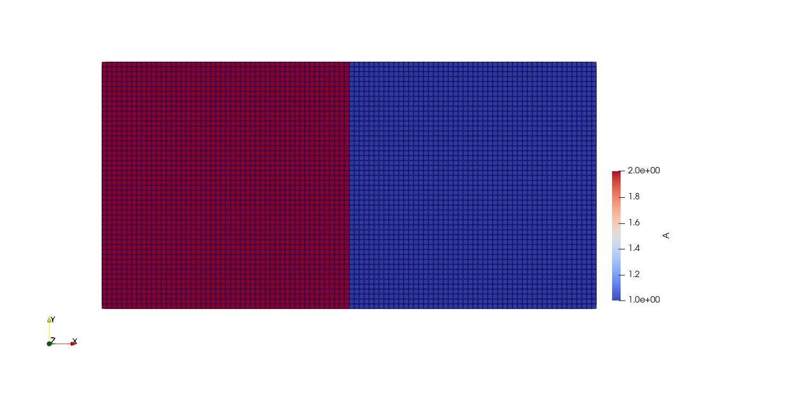
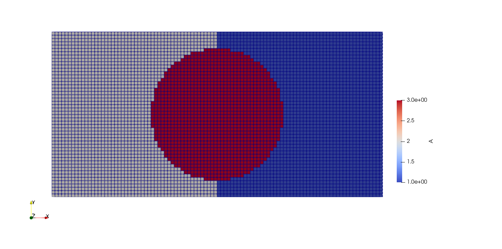
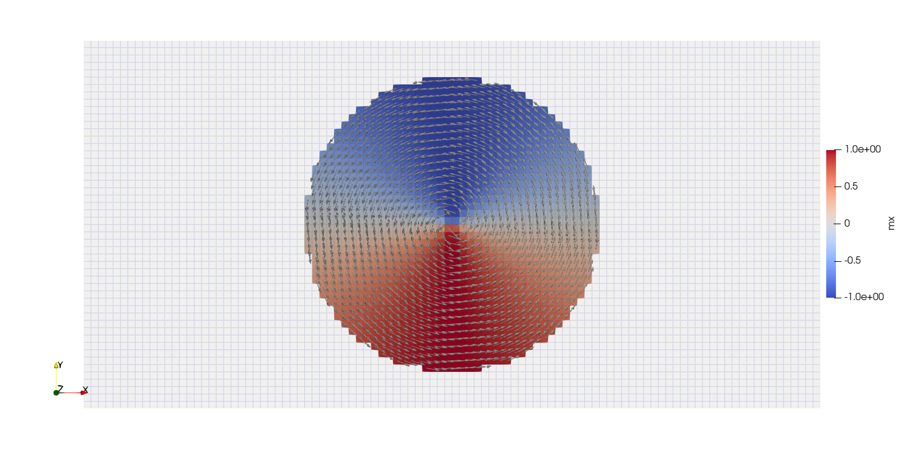

:tocdepth: 1

###################
State and Materials
###################

State
#####
As we have already seen in the demo of the muMAG Standard Problem #4 a state is initialized as follows:

.. code-block:: python

  n  = (100, 25, 1)
  dx = (5e-9, 5e-9, 3e-9)
  mesh = Mesh(n, dx, origin = (-50e-9, -12.5e-9, 0))
  state = State(mesh)

For this a mesh must be defined. `n` and `dx` are tuples with three entries each, to describe a three dimensional material, with n characterizing the size of the magnetic material and dx being the discretization by defining the dimensions of a cell. If not specified, the left bottom corner of the mesh will be located at (0,0,0). Here the origin was defined so that the middle of the mesh lies in the origin.

Set Floating Point Precision
****************************

Torch Global
============
Since magnum.np 2.0.0 the floating point precission is modified by setting PyTorch defaults. E.g.:

.. code-block:: python

  torch.set_default_dtype(torch.float32)

The used `dtype` is printed during the creation of a state object.

Device Selection
****************
The choice of which device is used to execute the code occurs by default. First it is determined whether GPUs are available. If GPUs are available the code will be executed on the GPU with the least amount of memory usage. If no GPUs are available the code will be run on the CPU.

In order to choose a processing unit manually you can set the environment variable `CUDA_DEVICE`. This can e.g be done directly in the command line which executes `pyhton`:

.. code-block:: python

  CUDA_DEVICE=2 python run.py

Positive integers refer to GPUs while `-1` can be used to run explicitly on CPU.

Materials
#########
The materials are defined as Python dictionaries. They can be set as constant and homogeneous as well as locally. In the muMAG Standard Problem #4 the material is constant and homogeneous, and thus, defined as follows:

.. code-block:: python

  state.material = {
    "Ms": 8e5,
    "A": 1.3e-11,
    "alpha": 0.02
    }

*Ms* is the saturation magnetization given in A/m, *A* defines the exchange constant in J/m and *alpha* represents the dimensionless Gilbert damping parameter.

Because materials are defined as Python dictionaries its items are accessed using their key names inside square brackets, as you can see here:

.. code-block:: python

  state.material["A"] = 1.

If the material is homogeneous this internally uses torch.tensor.expand to create the tensor [nx,ny,nz,1] and save memory.

Location-Dependent Materials
****************************
If the magnatic material is not homogeneous the user can define the material locally.

Slices
======
As already mentioned, a material parameter can be set for the whole mesh as follows:

.. code-block:: python

  mesh = Mesh((100, 50, 1), (1e-9, 1e-9, 1e-9), origin = (-50e-9, -25e-9, 0.))
  state = State(mesh)
  state.material["A"] = 1.

To define this material parameter in a certain area of the mesh Python's slicing is used, as shown in this example:

.. code-block:: python

  x,y,z = mesh.SpatialCoordinate()
  state.material["A"][:50,:,:,:] = 2

The result will look as follows:

.. _Sphinx Domains:

Domains
=======
Domains are certain areas of the material defined by boolean arrays. Instead of locally defining a parameter using slicing, one can first define a domain and subsequently set the parameter in this domain. Continuing the previous example, a circular domain is created and the parameter is set in this domain like so:

.. code-block:: python

  disk = x**2 + y**2 < 20e-9**2
  state.material["A"][disk] = 3.

Now the material will look like this:

Furthermore, the magnetization *m* can also be defined in such a domain. In this example, a vortex is initialized and the magnetization outside of the disk is set to zero.

.. code-block:: python

  state.m = Expression([-y,x,0*z]) # equivalent to torch.stack([-y,x,0*z], dim=-1)
  state.m[~disk] = 0
  normalize(state.m)

The magnetization of the material will look as follows:

Set multiple material parameters at once
========================================
In order to set several material parameters at once you can create a dictionary as follows:

.. code-block:: python

  material0 = {"A": 1., "Ms": 1.}

Using *material0* you can set these parameters in the whole material like so:

.. code-block:: python

  state.material.set(material0)

To set the material in a certain domain another such dictionary *material1* needs to be defined. The domain in which these properties are relevant is specified using a torch.Tensor. Then the material parameters stated in *material1* can be set in the area *domain1* as follows:

.. code-block:: python

  state.material.set(material1, domain1)

Time-Dependent Materials
************************
In case the material is time-dependent each parameter can be defined as a lambda function.
Since magnum.np 2.0.0 all lambda functions depend on the state and may therefor also depend on any state parameter like time, temperature, materials, ...
In this example *A* is set to be linearly dependent on time *t*:

.. code-block:: python

  state.material["A"] = lambda state: 1. * state.t

The material getter will always return the material corresponding to the current state. In case of constant materials a trivial lambda function is created duing setting the material.
