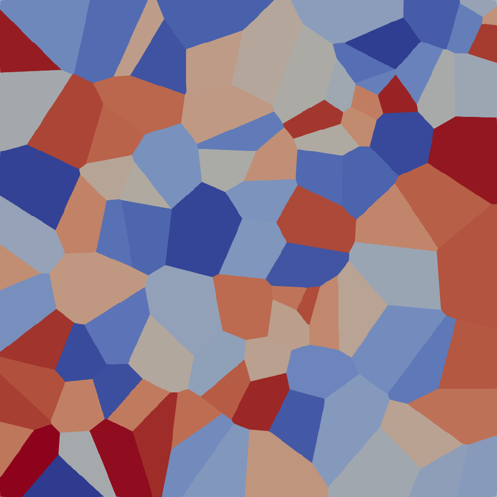
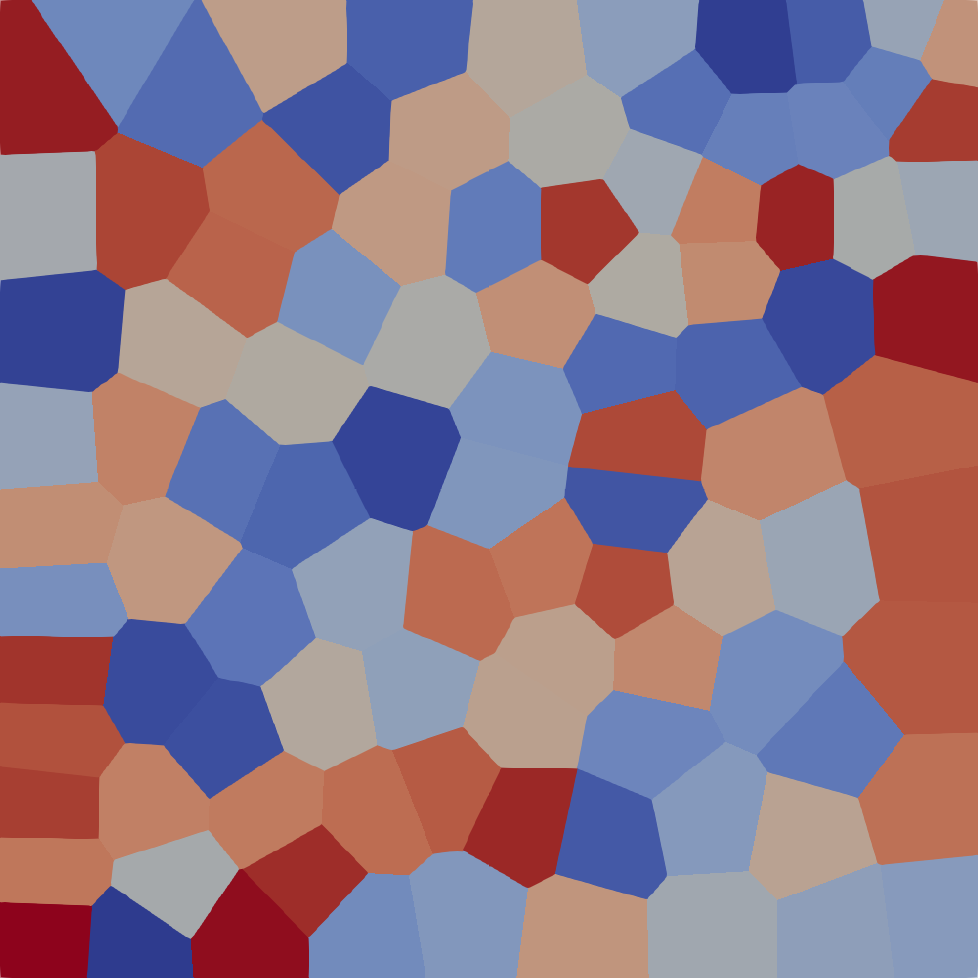
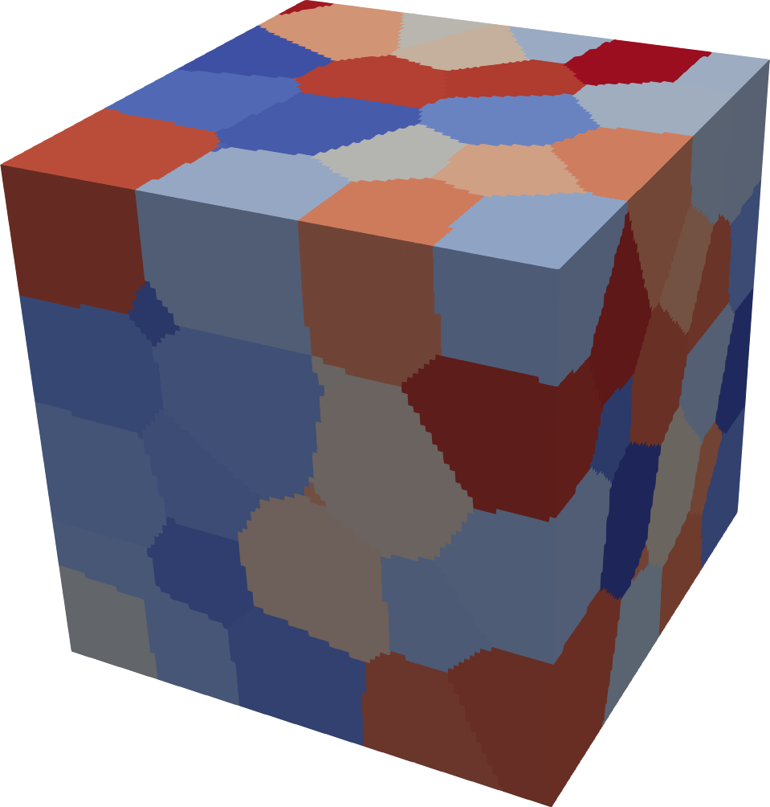
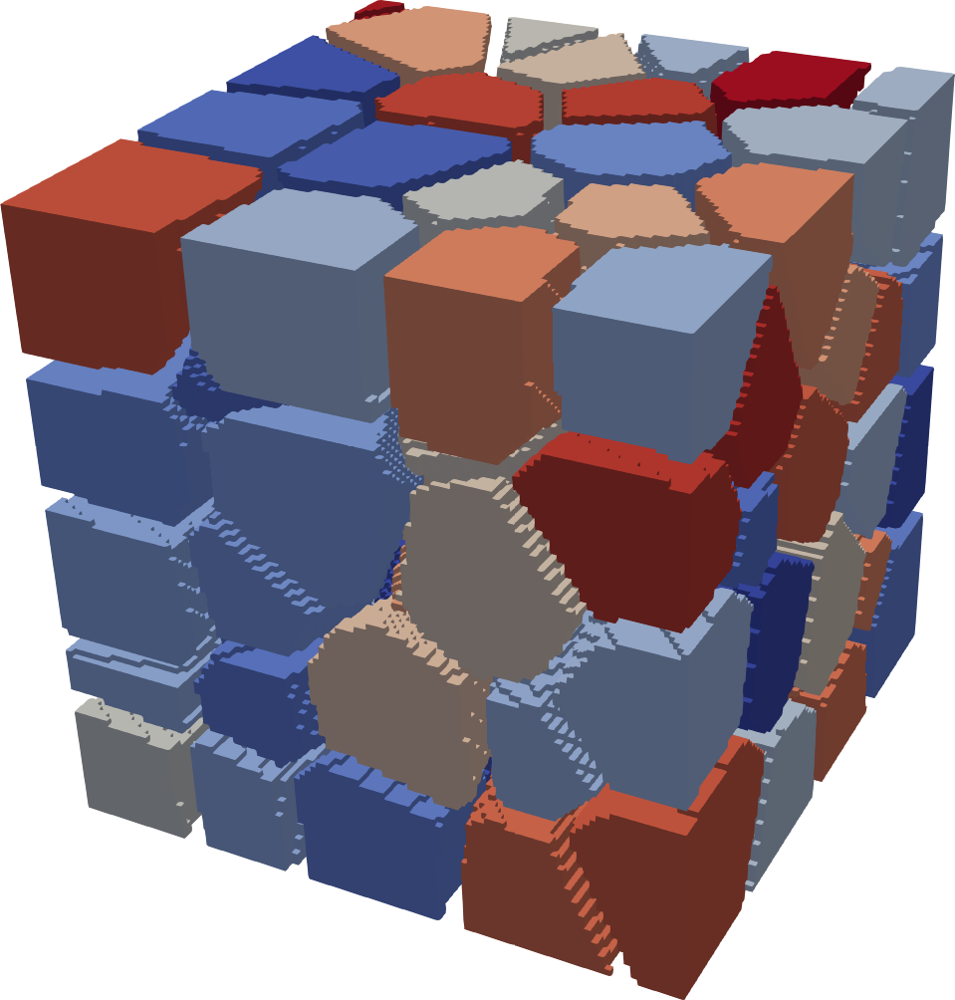

.. module:: magnumnp

:tocdepth: 1

###################
Voronoi Tesselation
###################

In order to accurately model the microstructure of magnetic materials one often uses a Voronoi Tesselation to create proper grain structures. After a `Mesh` object has been defined, a simple Voronoi Tesselation can be created using the `Voronoi` class. For example a thin film with with 10 domains can be created like this:

.. code-block:: python

  n = 1000, 1000, 1
  dx = 1e-9, 1e-9, 1e-9
  mesh = Mesh(n, dx)
  state = State(mesh)

  voi = Voronoi(mesh, 100)
  state.write_vtk(voi.domains, "voronoi_simple.vti")

By default `magnum.np` uses equally distributed `seed_points`, but the user can also provide selected `seed_points` as a parameter.
(e.g. `seed_points` could be chosen in a 2D plane in order to create quasi-2D grains). Since a simple Voronoi Tesselation leads to rather irregular grains, 
one can use Llyod's Method to improve the grain regularity. After an initial Voronoi Tesselation the center of each grain is calculated and those centers are
used as `seed_points` for the next iteration. E.g. the following code performes 10 iterations and yields a much more regular grain structure:

.. code-block:: python

  domains = voi.relax()
  state.write_vtk(voi.domains, "voronoi_relax.vti")

The code can be directly used also for 3D meshes without a modification:

.. code-block:: python

  n = 100, 100, 100
  dx = 1e-9, 1e-9, 1e-9
  mesh = Mesh(n, dx)
  state = State(mesh)

  voi = Voronoi(mesh, 100)
  domains = voi.relax()
  state.write_vtk(voi.domains, "voronoi_3d.vti")

For some applications an intergrain phase is needed, which separates the individual grains from each other.
A simple way to create such a layer is to use the gradient of the grain structure. This gradient is 0 inside of the grain and non-zero at all cells next to the interface of two grains.
Calculating higher order gradients allows to add more layers to the intergrain phase. 

The following code creates an interlayer phase with approximately 4 cells width:

.. code-block:: python

  voi.add_intergrain_phase(2)
  state.write_vtk(voi.domains, "voronoi_3d_interlayer.vti")

Finally, after the grain structure has been created, proper material parameters need to be assigned. Note that the domain array has type `int` and shape :math:`(n_x, n_y, n_z)` while the corresponding materials should be of type `float` and shape :math:`(n_x, n_y, n_z)` (in the following example casting to the correct shape is done automatically by the material setter). For example the following code assignes a normal distributed staturation magnetization to the grains and zero magnetization to the intergrain phase (which by default gets the last domain id):

.. code-block:: python

  Ms = 8e5
  Ms_values = torch.normal(Ms, 0.1*Ms, (101,))
  Ms_values[-1] = 0.
  state.material['Ms'] = Ms_values.take(voi.domains)

.. autoclass:: Voronoi
   :members:
   :special-members:
